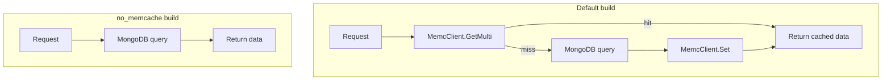

# Design Document: `no_memcache` Build Tag

## Overview

The `hotelReservation` application uses Memcached as a read-through / write-behind cache in three gRPC services: **profile**, **rate**, and **reservation**. Each service checks Memcached first and falls back to MongoDB on a cache miss, then writes the result back to Memcached.

This feature introduces a Go build tag `no_memcache` that, when supplied at compile time (`go build -tags no_memcache ./...`), removes all Memcached interactions from those three services. The resulting binary reads and writes directly from/to MongoDB, making Memcached entirely optional. The default build (no tag) is completely unaffected.

Primary use cases:
- Benchmarking MongoDB performance in isolation
- Running the application in environments where Memcached is unavailable
- Simplifying test setups that do not need a cache layer

---

## Architecture

The implementation uses Go's [build constraint](https://pkg.go.dev/cmd/go#hdr-Build_constraints) mechanism. Each affected service package gains two mutually exclusive source files for its handler logic:

```
services/profile/
  server.go          ← struct definition, Run/Shutdown, shared helpers (no build tag)
  server_cache.go    ← GetProfiles with Memcached path  (//go:build !no_memcache)
  server_nocache.go  ← GetProfiles direct MongoDB path  (//go:build no_memcache)

services/rate/
  server.go
  server_cache.go    ← GetRates with Memcached path     (//go:build !no_memcache)
  server_nocache.go  ← GetRates direct MongoDB path     (//go:build no_memcache)

services/reservation/
  server.go
  server_cache.go    ← CheckAvailability + MakeReservation with Memcached path  (//go:build !no_memcache)
  server_nocache.go  ← CheckAvailability + MakeReservation direct MongoDB path  (//go:build no_memcache)

cmd/profile/
  main.go            ← shared startup logic
  init_cache.go      ← MemcClient init + Server construction  (//go:build !no_memcache)
  init_nocache.go    ← Server construction without MemcClient (//go:build no_memcache)

cmd/rate/
  main.go
  init_cache.go                                               (//go:build !no_memcache)
  init_nocache.go                                             (//go:build no_memcache)

cmd/reservation/
  main.go
  init_cache.go                                               (//go:build !no_memcache)
  init_nocache.go                                             (//go:build no_memcache)
```

The `MemcClient` field on each `Server` struct is retained in all builds so that the struct definition stays in a single untagged file. Under the `no_memcache` build the field is simply left `nil` and never accessed.



---

## Components and Interfaces

### 1. Build-tag files per service

Each `server_nocache.go` file carries `//go:build no_memcache` at the top and re-implements only the RPC handler methods. The method signatures are identical to the cache path, satisfying the same gRPC-generated interface.

**Profile service — `server_nocache.go`**

```go
//go:build no_memcache

package profile

// GetProfiles queries MongoDB directly for every requested hotel ID.
func (s *Server) GetProfiles(ctx context.Context, req *pb.Request) (*pb.Result, error)
```

**Rate service — `server_nocache.go`**

```go
//go:build no_memcache

package rate

// GetRates queries MongoDB directly and returns rate plans sorted by TotalRate descending.
func (s *Server) GetRates(ctx context.Context, req *pb.Request) (*pb.Result, error)
```

**Reservation service — `server_nocache.go`**

```go
//go:build no_memcache

package reservation

// CheckAvailability queries MongoDB for capacity and reservation counts directly.
func (s *Server) CheckAvailability(ctx context.Context, req *pb.Request) (*pb.Result, error)

// MakeReservation queries MongoDB for capacity and reservation counts directly,
// then inserts reservation records without touching Memcached.
func (s *Server) MakeReservation(ctx context.Context, req *pb.Request) (*pb.Result, error)
```

### 2. Build-tag files per `cmd` entry point

Each `init_nocache.go` constructs the `Server` struct without calling `tune.NewMemCClient2`, so no Memcached address is required in the config.

```go
//go:build no_memcache

package main

func buildServer(result config.Values, mongoClient *mongo.Client, tracer opentracing.Tracer, reg *registry.Client) *profile.Server {
    return &profile.Server{
        Port:        servPort,
        IpAddr:      servIP,
        Tracer:      tracer,
        Registry:    reg,
        MongoClient: mongoClient,
        // MemcClient intentionally omitted
    }
}
```

The corresponding `init_cache.go` (tagged `!no_memcache`) contains the existing initialization logic that calls `tune.NewMemCClient2`.

### 3. Existing `server.go` files

The `Server` struct definition, `Run()`, `Shutdown()`, and any helper types remain in the untagged `server.go`. The `MemcClient *memcache.Client` field stays on the struct in all builds; it is simply `nil` in the `no_memcache` build and never dereferenced.

---

## Data Models

No new data models are introduced. The feature operates entirely at the service-logic layer and reuses the existing MongoDB collections and protobuf types.

| Service     | MongoDB database    | Collections used                    |
|-------------|---------------------|-------------------------------------|
| profile     | `profile-db`        | `hotels`                            |
| rate        | `rate-db`           | `inventory`                         |
| reservation | `reservation-db`    | `reservation`, `number`             |

The direct-path implementations query these collections with the same filters already used in the cache-miss branches of the existing code, so no schema changes are needed.

---

## Correctness Properties

*A property is a characteristic or behavior that should hold true across all valid executions of a system — essentially, a formal statement about what the system should do. Properties serve as the bridge between human-readable specifications and machine-verifiable correctness guarantees.*

### Property 1: No Memcached calls in profile service

*For any* non-empty list of hotel IDs, when `GetProfiles` is called under the `no_memcache` build, the `MemcClient` field SHALL never be invoked (no `GetMulti`, no `Set`), and MongoDB SHALL be queried for each requested hotel ID.

**Validates: Requirements 2.1, 2.3**

---

### Property 2: No Memcached calls in rate service

*For any* non-empty list of hotel IDs, when `GetRates` is called under the `no_memcache` build, the `MemcClient` field SHALL never be invoked, and MongoDB SHALL be queried for each requested hotel ID.

**Validates: Requirements 3.1, 3.3**

---

### Property 3: No Memcached calls in reservation service

*For any* valid reservation request (any hotel IDs, any in/out date range), when `CheckAvailability` or `MakeReservation` is called under the `no_memcache` build, no `MemcClient` method SHALL be called, and MongoDB SHALL be queried for capacity and reservation counts.

**Validates: Requirements 4.1, 4.2, 4.3**

---

## Error Handling

All three `server_nocache.go` implementations follow the same error-handling contract as the existing cache-miss branches:

| Situation | Behavior |
|-----------|----------|
| MongoDB query returns an error | Log the error with `log.Error().Msgf(...)` and return a non-nil `error` to the gRPC caller |
| MongoDB returns no documents for a hotel ID | Return an empty result for that ID (same as cache path) |
| `MemcClient` is `nil` | Never accessed; no nil-pointer risk |

The `no_memcache` path does **not** use `log.Panic` for MongoDB errors (unlike some existing cache-miss branches) — it returns the error to the caller so the gRPC framework can propagate it cleanly.

---

## Testing Strategy

### Build smoke tests

These verify compilation correctness and are run in CI as part of the standard build check:

```bash
# Default build must still compile
go build ./...

# no_memcache build must compile
go build -tags no_memcache ./...
```

These cover Requirements 1.1, 1.2, 5.1, 5.2, 5.3, 6.1, 6.2.

### Unit / example-based tests

Located alongside each service package (e.g., `services/profile/server_nocache_test.go`), tagged `//go:build no_memcache`:

- **Output shape parity**: seed an in-memory MongoDB (using `go.mongodb.org/mongo-driver`'s `mongomock` or a real embedded instance), call the no-cache handler, and assert the returned `*pb.Result` matches the expected structure. Covers Requirements 2.2, 3.2, 4.4, 6.3.
- **Error propagation**: inject a MongoDB client that returns an error; assert the handler returns a non-nil error. Covers Requirements 2.4, 3.4, 4.5.

### Property-based tests

The project uses Go, so property-based tests are written with [**`pgregory.net/rapid`**](https://github.com/flyingmutant/rapid), a well-maintained Go PBT library. Each property test is configured to run a minimum of **100 iterations**.

Each test file carries `//go:build no_memcache` so it only compiles and runs in the relevant build variant.

**Property 1 — No Memcached calls in profile service**

```
// Feature: memcache-opt-out, Property 1: No Memcached calls in profile service
```

Generator: produce a random non-empty slice of hotel ID strings. Inject a spy `MemcClient` (wrapping a nil server that panics on any call) and a mock MongoDB that returns stub `pb.Hotel` documents. Call `GetProfiles`. Assert:
- The spy recorded zero calls.
- The returned `Hotels` slice has the same length as the input ID list.

**Property 2 — No Memcached calls in rate service**

```
// Feature: memcache-opt-out, Property 2: No Memcached calls in rate service
```

Generator: random non-empty hotel ID slice. Same spy/mock pattern. Call `GetRates`. Assert zero MemcClient calls and that the returned `RatePlans` are sorted by `TotalRate` descending.

**Property 3 — No Memcached calls in reservation service**

```
// Feature: memcache-opt-out, Property 3: No Memcached calls in reservation service
```

Generator: random hotel ID, random in/out date pair (in < out, within a reasonable range). Same spy/mock pattern. Call both `CheckAvailability` and `MakeReservation`. Assert zero MemcClient calls in both cases.

### Test configuration

- Minimum **100 iterations** per property test (`rapid` default is 100; set explicitly with `rapid.Settings{Draws: 100}`).
- Property tests are excluded from the default `go test ./...` run via the `no_memcache` build tag; they are run with `go test -tags no_memcache ./...`.
- CI should run both `go test ./...` (default path) and `go test -tags no_memcache ./...` (direct path).
