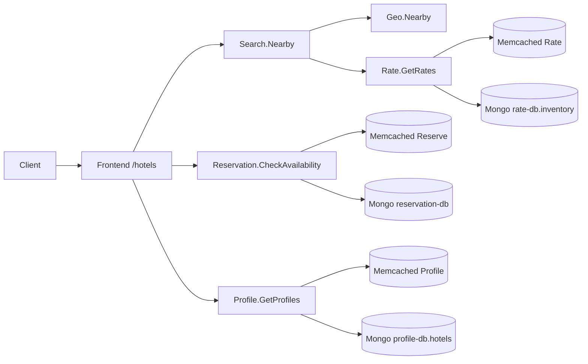
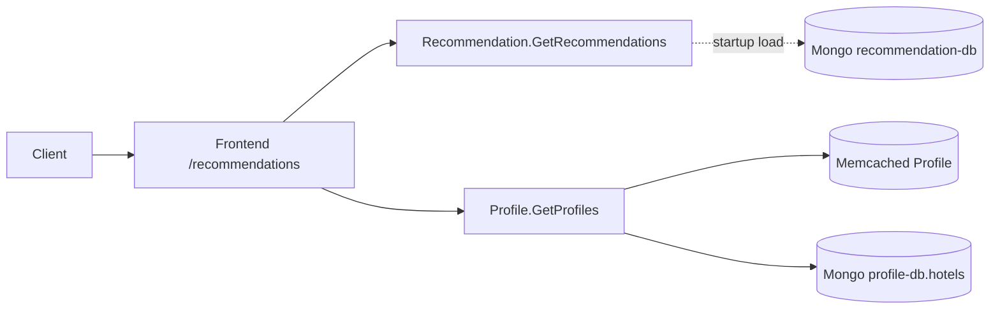
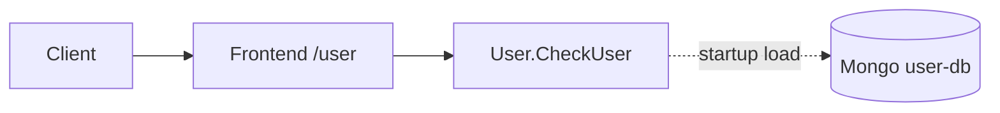
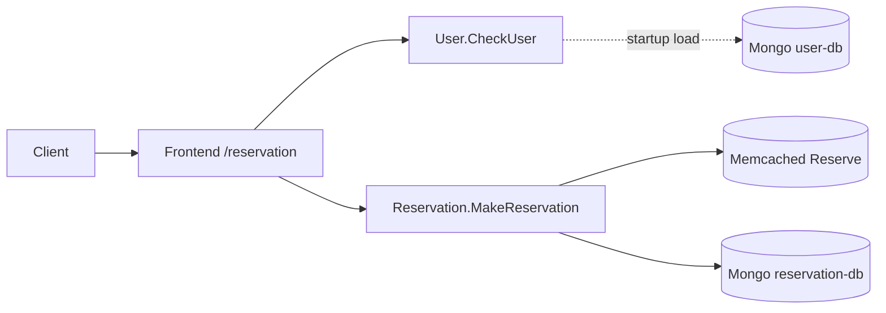

# Hotel Reservation

The application implements a hotel reservation service, build with Go and gRPC, and starting from the open-source project https://github.com/harlow/go-micro-services. The initial project is extended in several ways, including adding back-end in-memory and persistent databases, adding a recommender system for obtaining hotel recommendations, and adding the functionality to place a hotel reservation. 

<!-- ## Application Structure -->

<!--  -->

Supported actions:
* Get profile and rates of nearby hotels available during given time periods
* Recommend hotels based on user provided metrics
* Place reservations

## Request Call Graphs

The benchmark workload uses four request types (from `wrk2/scripts/hotel-reservation/mixed-workload_type_1.lua`):

- `GET /hotels` with 60% probability
- `GET /recommendations` with 39% probability
- `POST /user` with 0.5% probability
- `POST /reservation` with 0.5% probability

### `GET /hotels`



### `GET /recommendations`



### `POST /user`



### `POST /reservation`



## Pre-requirements
- Docker
- Docker-compose
- luarocks (apt-get install luarocks)
- luasocket (luarocks install luasocket)

## Running the hotel reservation application

### As Processes

To run the microservices as bare processes (no Docker), first follow the [installation instructions](../README.md).

1. Start backing services (Consul, MongoDB, Memcached, Jaeger):

```bash
./scripts/start_backing.sh
```

2. Start all microservices:

```bash
./scripts/start_services.sh
```

The script automatically picks up `config.local.json` if present. You can override with flags:

```bash
./scripts/start_services.sh --config /path/to/config.json --consul 10.0.0.1:8500 --jaeger 10.0.0.2:6831
```

To start a single service (e.g. for the placement algorithm):

```bash
./scripts/start_service.sh <service_name> [--config <path>] [--consul <addr>] [--jaeger <addr>]
```

3. Stop everything:

```bash
./scripts/stop_all.sh
```

4. Verify the deployment:

```bash
# Check Consul registration
curl http://localhost:8500/v1/catalog/services

# Test the frontend
curl "http://localhost:5000/hotels?inDate=2015-04-09&outDate=2015-04-10&lat=38.0235&lon=-122.095"
```

Service logs are written to `/tmp/hotel-logs/`.

### In Docker Containers


### Before you start
- Install Docker and Docker Compose.
- Make sure exposed ports in docker-compose files are available
- Consider which platform you want to use (docker-compose/openshift/kubernetes)
    - Build the required images using the proper method
        - In case of docker-compose => docker-compose build
        - In case of Openshift => run the build script according to the readme.
        - In case of kubernetes => run the build script according to the readme.

### Running the containers
##### Docker-compose
Start docker containers by running `docker compose up -d`. All images will be pulled from Docker Hub. In order to run `docker compose` with images built from the `Dockerfile`, run `docker compose up -d --build`.

The workload itself can be configured using optional enviroment variables. The available configuration items are:

- TLS: Environment variable TLS controls the TLS enablement of gRPC and HTTP communications of the microservices in hotelReservation.
    - TLS=0 or not set(default): No TLS enabled for gRPC and HTTP communication.
    - TLS=1: All the gRPC and HTTP communications will be protected by TLS, e.g. `TLS=1 docker compose up -d`.
    - TLS=<ciphersuite>: Use specified ciphersuite for TLS, e.g. `TLS=TLS_ECDHE_RSA_WITH_AES_128_GCM_SHA256 docker- ompose up -d`. The avaialbe cipher suite can be found at the file [options.go](tls/options.go#L21).

- GC: Environment variable GC controls the garbage collection target percentage of Golang runtime. The default value is 100. See [golang doc](https://pkg.go.dev/runtime/debug#SetGCPercent) for details.

- JAEGER_SAMPLE_RATIO: Environment variable JAEGER_SAMPLE_RATIO controls the ratio of requests to be traced Jaeger. Default is 0.01(1%).

- MEMC_TIMEOUT: Environment variable MEMC_TIMEOUT controls the timeout value in seconds when communicating with memcached. Default is 2 seconds. We may need to increase this value in case of very high work loads.

- LOG_LEVEL: Environment variable LOG_LEVEL controls the log verbosity. Valid values are: ERROR, WARNING, INFO, TRACE, DEBUG. Default value is INFO.

Users may run `docker compose logs <service>` to check the corresponding configurations.

##### Openshift
Read the Readme file in Openshift directory.

##### Kubernetes
Read the Readme file in Kubernetes directory.

#### workload generation
```bash
../wrk2/wrk -D exp -t <num-threads> -c <num-conns> -d <duration> -L -s ./wrk2/scripts/hotel-reservation/mixed-workload_type_1.lua http://x.x.x.x:5000 -R <reqs-per-sec>
```

To benchmark a single frontend endpoint with Poisson arrivals while collecting power under different CPU governors, use:

```bash
./scripts/run_power_sweep.sh --target hotels --governor schedutil --rates 1000:7000:1000
./scripts/run_power_sweep.sh --target hotels --governor performance --rates 1000:7000:1000
```

The script:

- uses `wrk2` with `-D exp` and `wrk2/scripts/hotel-reservation/single-endpoint.lua`
- targets one frontend request type at a time: `hotels`, `recommendations`, `reservation`, or `user`
- switches the requested CPU governor with `sudo` before the sweep
- measures average power with `powerstat`
- writes per-run logs plus a `results.csv`
- generates `arrival_rate_vs_power.png` for the requested governor run

To clone or refresh the repo across experiment nodes and run one target per host in parallel, use:

```bash
./scripts/run_distributed_power_sweeps.sh \
  --hosts node1,node2,node3,node4 \
  --ssh-user <user> \
  --ssh-key ~/.ssh/<cloudlab-key> \
  --private-key ~/.ssh/<github-deploy-key>
```

The distributed entrypoint is now a Python orchestrator, aligned with the remote setup flow used in `envoy-imbalancer-exp`:

- `scripts/power_sweep_remote_config.py` holds reusable node/auth defaults
- `scripts/power_sweep_remote_util.py` provides shared Paramiko helpers
- `scripts/run_distributed_power_sweeps.py` bootstraps remote checkouts and runs governor phases in parallel

Use `--refresh-repo` to `git fetch` and `git pull --ff-only` on existing remote checkouts before starting a new sweep.

### Questions and contact

You are welcome to submit a pull request if you find a bug or have extended the application in an interesting way. For any questions please contact us at: <microservices-bench-L@list.cornell.edu>
